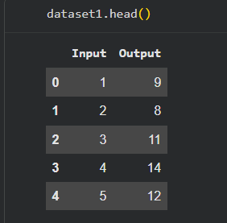
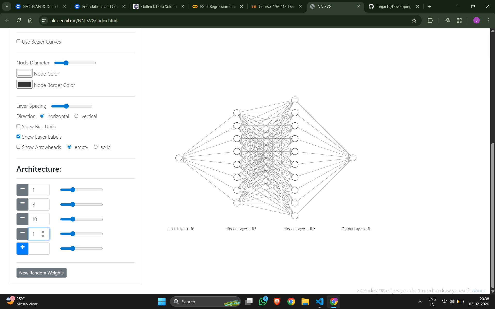
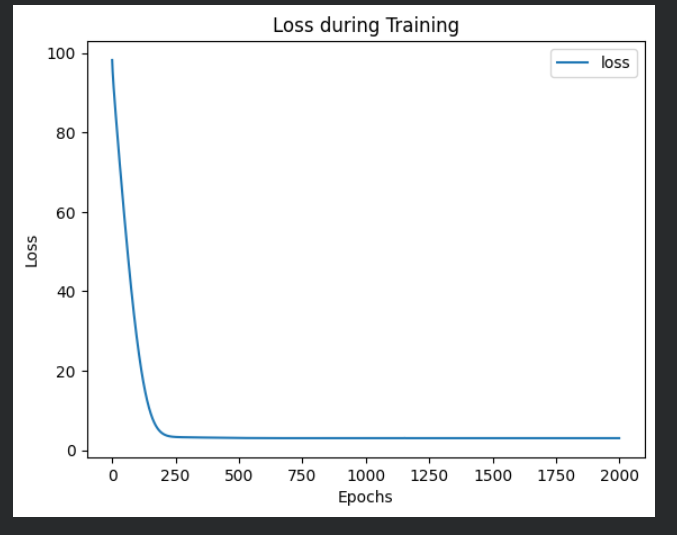
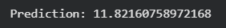

# Developing a Neural Network Regression Model

## AIM
To develop a neural network regression model for the given dataset.

## THEORY
Explain the problem statement

## Neural Network Model
Include the neural network model diagram.

## DESIGN STEPS
### STEP 1: 

Create your dataset in a Google sheet with one numeric input and one numeric output.

### STEP 2: 

Split the dataset into training and testing

### STEP 3: 

Create MinMaxScalar objects ,fit the model and transform the data.

### STEP 4: 

Build the Neural Network Model and compile the model.

### STEP 5: 

Train the model with the training data.

### STEP 6: 

Plot the performance plot

### STEP 7: 

Evaluate the model with the testing data.

### STEP 8: 

Use the trained model to predict  for a new input value .

## PROGRAM

### Name: Junjar U

### Register Number: 212224230110

```python
class NeuralNet(nn.Module):
    def __init__(self):
        super().__init__()
        #Include your code here
        self.fc1 = nn.Linear(1,8)
        self.fc2 = nn.Linear(8,10)
        self.fc3 = nn.Linear(10,1)
        self.relu = nn.ReLU()
        self.history = {'loss':[]}
        # Include your code here
  def forward(self,x):
    x = self.relu(self.fc1(x))
    x = self.relu(self.fc2(x))
    x = self.fc3(x)
    return x


# Initialize the Model, Loss Function, and Optimizer
ai_brain = NeuralNet()
criterion = nn.MSELoss()
optimizer = optim.RMSprop(ai_brain.parameters(), lr=0.001)


def train_model(ai_brain, X_train, y_train, criterion, optimizer, epochs=2000):
    #Include your code here
    for epoch in range(epochs):
        optimizer.zero_grad()
        loss = criterion(ai_brain(X_train), y_train)
        loss.backward()
        optimizer.step()


        ai_brain.history['loss'].append(loss.item())
        if epoch % 200 == 0:
            print(f'Epoch [{epoch}/{epochs}], Loss: {loss.item():.6f}')

train_model(ai_brain, X_train_tensor, y_train_tensor, criterion, optimizer)
with torch.no_grad():
    test_loss = criterion(ai_brain(X_test_tensor), y_test_tensor)
    print(f'Test Loss: {test_loss.item():.6f}')
loss_df = pd.DataFrame(ai_brain.history)

import matplotlib.pyplot as plt
loss_df.plot()
plt.xlabel("Epochs")
plt.ylabel("Loss")
plt.title("Loss during Training")
plt.show()

X_n1_1 = torch.tensor([[9]], dtype=torch.float32)
prediction = ai_brain(torch.tensor(scaler.transform(X_n1_1), dtype=torch.float32)).item()
print(f'Prediction: {prediction}')
```

### Dataset Information
Include screenshot of the generated data


### OUTPUT

### Training Loss Vs Iteration Plot
Include your plot here

### New Sample Data Prediction
Include your sample input and output here


## RESULT
Thus, a neural network regression model was successfully developed and trained using PyTorch.
